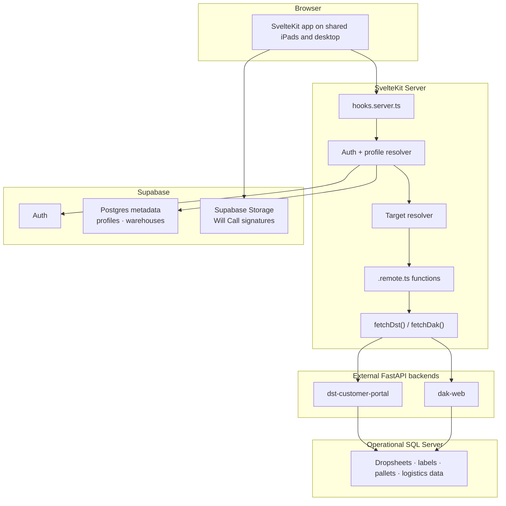

# Architecture: Stage & Load Barcode Module Frontend

**Version**: 1.6
**Date**: 2026-04-16

---

## Architecture Summary

This repository owns the SvelteKit 5 frontend only. It authenticates users with Supabase, resolves access rules from Supabase profile metadata, and proxies all operational warehouse requests to the existing Heroku FastAPI backends. The browser never calls Heroku directly.

The architecture is built around shared iPads, hardware barcode scanners, and fast repeat scanning. That leads to three important design rules:

1. Workflow state is mostly in memory and intentionally disposable.
2. Access and environment resolution happen server-side.
3. Scan requests use a same-origin server proxy so backend targets remain private and case-sensitive routing stays centralized.

---

## Technology Stack

### Frontend

- **SvelteKit 5**
- **Svelte 5**
- **TypeScript**
- **Bun 1** for package management, installs, and local script execution
- **Tailwind CSS 4**
- **shadcn-svelte**
- **Bits UI**
- **@lucide/svelte**
- **svelte-sonner**
- **Node.js 24** as the default deployment/runtime baseline unless a future ticket explicitly adopts the Bun runtime on Vercel

### Authentication and access metadata

- **Supabase Auth** for email/password authentication
- **@supabase/ssr** for browser/server clients and auth cookies
- **Supabase Postgres** for auth-linked metadata tables:
  - `profiles`
  - `warehouses`

### External backend dependencies

- **dst-customer-portal** (Heroku FastAPI)
- **dak-web** (Heroku FastAPI)
- **Microsoft SQL Server** as the operational data store used by both FastAPI services

### Live storage use

- **Supabase Storage** for Will Call signature upload and signed-URL retrieval

---

## System Architecture



---

## Access Model

### Authentication

- Users sign in with Supabase email/password auth.
- Accounts are created manually in Supabase by administrators.
- Password recovery uses a code-based reset flow inside the app.
- The Supabase recovery email template must be configured to emit the recovery token/code for this flow; the default reset link template is not sufficient for the in-app OTP screen.

### Profile gate

After authentication, the server must load the linked profile before allowing the user into the application:

- If the profile is inactive, the user is blocked.
- If the profile is missing, the user is also treated as blocked.
- If the profile is active, the server resolves the operational target.

### Target resolution

#### Non-admin users

- Read `profiles.warehouse_id`
- Look up `warehouses.alias`
- Resolve to `Canton` or `Freeport`
- If missing or invalid, fall back to `Canton` for now
- User cannot change the target manually

#### Admin users

- `profiles.user_role = admin`
- User can choose:
  - `Canton`
  - `Freeport`
  - `Sandbox`
- Selector appears after login for each new session
- Selector can also be reopened later from Home

### Persistence rules

- Auth session lives in Supabase-managed cookies
- Admin-selected target lives in the HttpOnly session cookie `dak_active_target` because server-side proxy helpers must read it on every request
- Workflow state such as loader, department, drop area, current drop, and scan text should remain in memory only

---

## Request Lifecycle

### Request guard

`hooks.server.ts` is the single access-control gate for the app. On each request it:

1. Creates the Supabase SSR server client
2. Calls `supabase.auth.getUser()` for verified identity
3. Loads `profiles` and looks up `warehouses.alias`
4. Resolves the active access state and target
5. Stores the results on `event.locals`
6. Applies redirects before page-specific logic runs

### Access states

The resolved server auth context uses these access states:

- `anonymous`
- `inactive`
- `operator-ready`
- `admin-needs-target`
- `admin-ready`

### `event.locals` contract

The server places these values on `event.locals`:

- `supabase`
- `getVerifiedUser()`
- `authContext`

`authContext` contains:

- verified Supabase user
- linked profile
- `isActive`
- `role`
- `isAdmin`
- resolved `target`
- final `accessState`

### Redirect rules

The redirect matrix is centralized in the hook:

- anonymous user on app route -> `/login`
- anonymous user on auth route -> allowed
- missing profile -> `/inactive`
- inactive profile -> `/inactive`
- active non-admin on auth route -> `/home`
- active non-admin hitting `/location` -> `/home`
- active admin with no selected target -> `/location`
- active admin with selected target on auth route -> `/home`

### Safe layout data

The app layout server load returns a minimal UI-safe subset of auth state for downstream routes:

- `displayName`
- `userRole`
- `isAdmin`
- `activeTarget`

---

## Backend Routing Contract

The frontend must normalize targets differently for each backend:

| Conceptual target | `dst-customer-portal` | `dak-web` |
|---|---|---|
| Canton | `db=Canton` | `X-Db: CANTON` |
| Freeport | `db=Freeport` | `X-Db: FREEPORT` |
| Sandbox | `db=Sandbox` | `X-Db: SANDBOX` |

This normalization should happen in one shared place, not throughout the app.

---

## Route Structure

The route tree should stay small and stable:

```text
src/routes/
├── (auth)/
│   ├── login/+page.svelte
│   ├── forgot-password/+page.svelte
│   └── reset-password/+page.svelte
└── (app)/
    ├── +layout.server.ts
    ├── +layout.svelte
    ├── account/+page.svelte
    ├── home/+page.svelte
    ├── loaders/+page.svelte
    ├── location/+page.server.ts
    ├── location/+page.svelte          # admin-only selector
    ├── inactive/+page.svelte
    ├── dropsheets/+page.svelte
    ├── select-category/[dropsheetId]/+page.svelte
    ├── order-status/[dropsheetId]/+page.svelte
    ├── move-orders/[dropsheetId]/+page.svelte
    ├── staging/+page.svelte
    └── loading/+page.svelte           # receives loading context from navigation params
```

### Route behavior notes

- Re-entry always returns to Home for valid sessions
- `location` is an admin-only utility route, not a general operator step
- `inactive` is the blocked screen shown after successful auth but failed profile eligibility

---

## Remote Functions

This project uses SvelteKit remote functions for same-origin server calls.

### Required configuration

Remote functions are enabled only when both of these flags are present in `svelte.config.js`:

- `kit.experimental.remoteFunctions = true`
- `compilerOptions.experimental.async = true`

### Source of truth for examples

Remote function examples in this document were checked against current SvelteKit docs. The current patterns use imports from `$app/server`.

### Core remote-function files

```text
src/lib/
├── types/
│   ├── index.ts
│   ├── raw-dst.ts
│   └── raw-dak.ts
├── server/
│   ├── proxy.ts
│   ├── auth-context.ts
│   └── type-mappers.ts
├── loaders.remote.ts
├── dropsheets.remote.ts
├── drop-areas.remote.ts
├── load-view.remote.ts
├── staging.remote.ts
├── scan.remote.ts
├── department-status.remote.ts
└── loader-session.remote.ts
```

`.remote.ts` files must stay outside `$lib/server`. Shared canonical types live in `$lib/types`, while proxy helpers and raw-to-domain normalization stay in `$lib/server`.

### Example: remote command

```ts
import * as v from 'valibot';
import { command } from '$app/server';
import { fetchDak } from '$lib/server/proxy';

const stagingScanSchema = v.object({
	scanned_text: v.string(),
	department: v.string(),
	drop_area_id: v.number()
});

export const processStagingScan = command(stagingScanSchema, async (input) => {
	const response = await fetchDak('/v1/scan/process-staging', {
		method: 'POST',
		body: JSON.stringify(input)
	});

	if (!response.ok) {
		throw new Error(await response.text());
	}

	return await response.json();
});
```

### Example: query batching

```ts
import * as v from 'valibot';
import { query } from '$app/server';

export const getWeather = query.batch(v.string(), async (cityIds) => {
	const lookup = new Map(cityIds.map((cityId) => [cityId, { cityId }]));
	return (cityId) => lookup.get(cityId);
});
```

### Component calling patterns

- Queries can be awaited directly in Svelte templates or handled via their loading/error/current state when they are created in a reactive context.
- Imperative one-off reads in event handlers, modal submits, or other non-reactive browser code must call `.run()` instead of awaiting the query directly.
- Commands are called from event handlers and should be wrapped in clear error handling.
- Successful scan commands should refresh the affected queries and immediately restore scanner readiness.
- Loading scan commands can keep a non-numeric scan pending when the backend returns `needs_location`; the page should stay scanner-ready, accept the next numeric driver-location scan, and only hand off the richer modal flow to the dedicated follow-on issue.
- Operator-facing banners should sanitize framework/runtime URLs before rendering them to shared-floor users.

---

## Proxy Layer

### `getAuthContext()`

Shared server helper that should resolve:

- verified Supabase user
- active profile
- resolved target
- JWT access token

### `fetchDst(path, options?)`

- Adds `Authorization: Bearer <jwt>`
- Adds `db=<TitleCaseTarget>` query parameter

### `fetchDak(path, options?)`

- Adds `Authorization: Bearer <jwt>`
- Adds `X-Db: <UPPERCASE_TARGET>` header

### Design rule

The browser should never know Heroku URLs, target normalization rules, or FastAPI auth/header requirements.

---

## State Management Strategy

### Server-derived state

- authenticated user
- profile
- active target
- access eligibility

### Session-scoped client state

- selected loader for the current loading start flow
- selected department
- selected drop area
- current scan text

### Page-local state

- current drop index
- drop detail data
- loading labels list
- list refresh state
- current need-pick count

### Browser-cached lookup lists

- The stable loader, trailer, and drop-area lookup lists use browser-side persistent cache wrappers around their remote queries.
- Manual refresh controls always re-run the query and replace the cached payload when the backend returns new data.
- This cache is intentionally narrow; scan state, selection state, and session-scoped workflow data remain memory-only.

### What not to persist broadly

Do not persist normal workflow state in long-lived local browser storage. Shared iPads make that dangerous and confusing.

---

## Scan UX Rules

- Hardware scanner input is the primary path
- Scan field should stay focused or be quickly restored after each interaction
- Success feedback should be lightweight:
  - short toast/banner
  - refresh affected list/query
  - ready for next scan immediately
- No offline queueing
- Desktop exists for debugging and development, not as the primary operational target

---

## Key Design Decisions

### 1. Frontend-only ownership in this repository

This repository builds the SvelteKit frontend. Backend endpoint work happens in the FastAPI repositories and is tracked here only as an external dependency.

### 2. Supabase Postgres is used for auth-linked metadata, not operational warehouse data

Operational dropsheets, labels, pallets, and logistics data remain in SQL Server behind the FastAPI services. Supabase Postgres is used for auth-linked metadata such as roles and warehouse assignment.

### 3. Admin-only manual environment selection

The old global location selection model is no longer the primary user path. Operators are warehouse-locked through their profiles. Manual selection remains only for `admin` users.

### 4. Home is the stable reset point

On shared iPads, active sessions should always re-enter on Home. This reduces accidental continuation of stale workflows after device handoff.

### 5. TDD is a delivery requirement

All implementation work in this project should follow test-driven development: write the failing test first, make it pass with the smallest change, then refactor safely.

---

## Environment Variables

```env
# Public Supabase config
PUBLIC_SUPABASE_URL=https://your-project.supabase.co
PUBLIC_SUPABASE_ANON_KEY=eyJ...

# Private backend URLs
DST_PORTAL_URL=https://dst-customer-portal-bfe4c7fdc773.herokuapp.com
DAK_WEB_URL=https://dak-web-e661a0c35a99.herokuapp.com
```

Additional environment variables may be needed later for password-reset redirect behavior, but the core proxy contract above remains unchanged.
